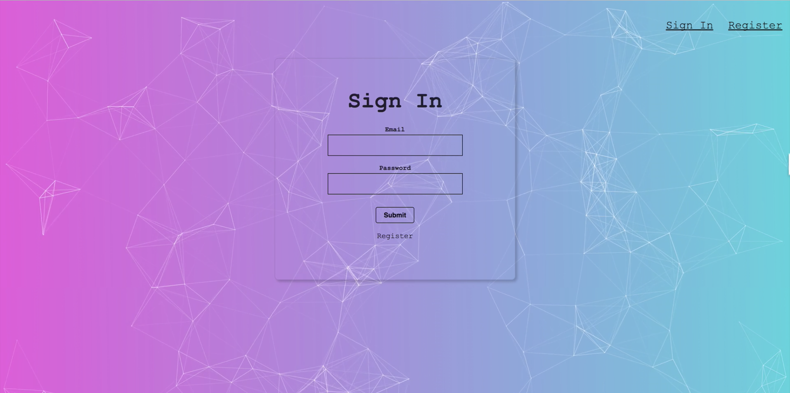

This project was bootstrapped with [Create React App](https://github.com/facebook/create-react-app).

# Welcome to SmartBrain!

Create a full responsive web application the uses React on the Front-End, an image-recoginition API, our own server using Node and Express.js, and a database we created using PostgreSQL.

## Features

- User can login with credentials
- Fetch Data using image-recognition API
- Logout of session
- Mobile responsive
- Input URL and image display functionality
- Display box around facial image

## Available Scripts and Running

### `Clone Repo`

In the project directory, you can run:

### `npm install`

Runs the installation to ensure that the dependencies remain the same on all machines the project is installed on.

### `npm run start-dev`

Runs the app in the development mode. 
Open [http://localhost:3000](http://localhost:3000) to view it in the browser.

The page will reload if you make edits. 
You will also see any lint errors in the console.

### `npm test`

Launches the test runner in the interactive watch mode. 
See the section about [running tests](https://facebook.github.io/create-react-app/docs/running-tests) for more information.

### `npm run build`

Builds the app for production to the `build` folder. 
It correctly bundles React in production mode and optimizes the build for the best performance.

The build is minified and the filenames include the hashes. 
Your app is ready to be deployed!

See the section about [deployment](https://facebook.github.io/create-react-app/docs/deployment) for more information.
